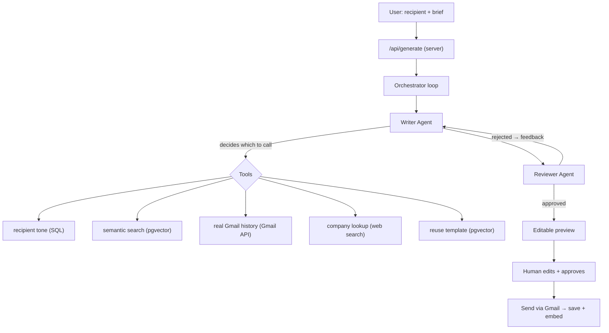

# Mail-AI ✉️🤖

> An AI email assistant where you describe an email in plain words, two AI agents write and review it, and **only after you approve** does it send from your own Gmail — with memory of your past conversations so every email sounds like *you*.

**Live demo:** [mail-ai-by-sajeel.vercel.app](https://mail-ai-by-sajeel.vercel.app) · **Stack:** Next.js 16 · OpenAI Agents SDK (on Gemini) · Supabase · Postgres + pgvector

> ⚠️ The live app reads Gmail, a Google *restricted scope*, so it runs in **testing mode** — only approved test users can sign in. This is the correct approach for a project without a paid Google security assessment. Ask for access to try it.

<!-- Add a demo GIF here: drag a screen recording of the full flow into the repo and link it -->
<!--  -->

---

## What it is

Most "AI email" tools are a single prompt behind a text box. Mail-AI is different: the AI is given a **set of tools and decides on its own** which to use for each email, a **second agent reviews** the first one's work, and the **human always approves** before anything sends. That decision-making — an agent choosing tools and handing off to another agent — is what makes it genuinely *agentic*, not a wrapper.

**The flow, from the user's side:**
1. Sign in with Google (one click handles both login and Gmail permission).
2. Type a recipient + a short brief: *"Reply to Sara confirming the demo, keep it friendly."*
3. A **Writer** agent gathers context with its tools and drafts the email; a **Reviewer** agent critiques it and sends it back for a rewrite if needed.
4. You read the draft, **edit it directly**, or ask the agent to revise ("make it shorter").
5. You click **Approve & Send** — it sends from *your* Gmail and is saved (and embedded) for future context.

---

## ✨ Features

- **Two-agent pipeline** — a Writer drafts, a Reviewer critiques and loops until it's good.
- **Real tool-use** — the agent *decides* when to call each of 5 tools (see below).
- **RAG memory (pgvector)** — past emails are embedded and searched by *meaning*, so follow-ups reference what was actually said.
- **Reads your real Gmail** — via OAuth + the Gmail API, so replies are grounded in the recipient's actual messages.
- **Human-in-the-loop** — the AI never sends on its own; you approve every send and can edit the exact text.
- **Personalized signatures** — a one-time profile is injected into every email (no more `[Your Name]`).
- **Provider-agnostic** — runs on Gemini via the OpenAI-compatible endpoint; swapping to OpenAI is a few lines.

---

## 🧠 Why it's "agentic," not a wrapper

The key idea: the agent is given **tools** and **chooses** which to use based on the task.

| A **tool** | An **agent** |
|---|---|
| plain code that does one job (a SQL query, a web search) | an LLM given instructions + tools that *decides* what to call |
| no intelligence | reasons, calls tools, reads results, hands off to another agent |

Mail-AI has 2 agents and 5 tools. The Writer reads your brief and picks tools by **intent** — that decision-making is the whole point.

---

## 🏗️ Architecture



**Security boundary:** the Writer's tools run on the server. The logged-in `userId` is passed to tools through the SDK's trusted **context** (never as an LLM-controlled parameter), so a prompt-injection can't trick the agent into reading another user's data.

---

## 🛠️ The tools

| Tool | What it does | Source | Fires when |
|---|---|---|---|
| `lookup_recipient_context` | your usual tone + recent subjects with this person | Postgres (SQL) | always (tone check) |
| `search_previous_threads` | semantically finds your past emails to this person | Postgres + **pgvector** | **follow-ups** on emails you sent |
| `lookup_gmail_history` | reads the recipient's real Gmail thread (their replies too) | **Gmail API** | **replies** to their message |
| `find_my_template` | reuse the *style* of a past email as a template | pgvector | only when you explicitly ask |
| `lookup_company` | what the recipient's company does, from its domain | web search (Tavily) | new **business** contacts |

Tools are chosen by **intent** — replying to someone → real Gmail; following up on your own email → semantic DB search — which keeps one contact's context from leaking into another's email.

---

## 🧩 Key design decisions (the *why*)

- **Two agents, not one prompt.** A single "write then check yourself" prompt is lenient on its own work. A separate Reviewer with its own instructions is genuinely more critical — and demonstrates multi-agent orchestration.
- **Retrieval scope is a correctness decision, not just relevance.** Semantic search is scoped **per-recipient** so a payment deadline you gave *one* person can't leak into an email to *another*.
- **`userId` travels via trusted context, never as a tool parameter.** The LLM can pick *what* to search (a query) but never *whose* data to access — that's set by the server.
- **Direct `pg` + pgvector instead of the Supabase client.** Gives full SQL control and makes vector search plain SQL. Trade-off: it bypasses Row-Level Security, so every query is manually scoped by `user_id` (RLS is still enabled to protect Supabase's public API).
- **Provider-agnostic.** The Agents SDK points at Gemini's OpenAI-compatible endpoint, so switching to a paid OpenAI key is a few lines.
- **Human-in-the-loop by design.** The draft is fully editable and nothing sends without an explicit click.

---

## ⚙️ Tech stack

- **Framework:** Next.js 16 (App Router), React 19, TypeScript
- **Agents:** OpenAI Agents SDK, running on **Gemini** (free, OpenAI-compatible endpoint)
- **Auth:** Supabase Auth — Google OAuth (login + Gmail permission in one)
- **Database:** Supabase Postgres via `pg`, with **pgvector** for semantic search
- **Email:** `nodemailer` (send) · `googleapis` (read Gmail)
- **Web search:** Tavily
- **UI:** Tailwind CSS (brutalist theme)
- **Hosting:** Vercel

---

## 🚀 Running locally

**Prerequisites:** Node 20+, a Supabase project, a Google Cloud OAuth client, a Gemini API key.

```bash
git clone https://github.com/<you>/mail-ai.git
cd mail-ai
npm install
```

Create `.env.local`:

```bash
# Supabase
NEXT_PUBLIC_SUPABASE_URL=...
NEXT_PUBLIC_SUPABASE_ANON_KEY=...
SUPABASE_SERVICE_ROLE_KEY=...
DATABASE_URL=postgresql://...        # use the connection pooler for serverless

# AI
GEMINI_API_KEY=...

# Sending (Stage 1: your own Gmail via App Password)
MY_EMAIL=you@gmail.com
APP_PASS=...                          # 16-char Gmail App Password

# Gmail read + OAuth
GOOGLE_CLIENT_ID=...
GOOGLE_CLIENT_SECRET=...

# Web search
TAVILY_API_KEY=...
```

**Database setup** (Supabase SQL editor): enable `pgvector`, create the `emails` and `profiles` tables with Row-Level Security, and add the `embedding vector(768)` column. See `/docs` (or the SQL in this repo).

**Google OAuth:** enable the Gmail API, add the `gmail.readonly` scope, keep the consent screen in **Testing** and add yourself as a test user.

```bash
npm run dev
# open http://localhost:3000
```

---

## ⚠️ Limitations & next steps

Being honest about the edges:

- **Testing-mode Gmail** — reading Gmail is a restricted scope; public access needs a paid Google security assessment, so the app is invite-only (test users). The DB-based features work for any user without Gmail permission.
- **Free-tier reliability** — the free Gemini tier rate-limits and occasionally returns 503s; a generation can be slow. Retries help; a production build would use a paid key.
- **Single-account sending** — sending currently uses one Gmail App Password. Multi-user sending (each user's own Gmail via OAuth) is designed for but not yet built — the token infrastructure from the Gmail-read feature is already in place.
- **No automated tests yet** — next on the list.

**Planned:** OAuth multi-user sending · scheduled send · a conversation-history sidebar · a small test suite.

---

## 📚 What I learned

This was my first agentic AI project. The interesting parts weren't the individual features but the **decisions**: how to give an agent tools safely (context vs parameters), when retrieval scope becomes a *correctness* rather than relevance question, and how to combine a semantic DB memory with real inbox reading without the two contexts clashing.

---

*Built by Sajeel.*
